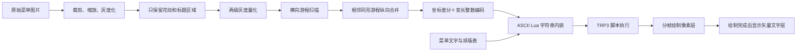

# OvoFrame 像素＋矢量界面制作指南

本文记录 RPBox 仓库中“海妖之颂菜单”的完整制作方法，目标是在 TRP3 Extended/OvoFrame 脚本环境中，将图片风格、可读文字、翻页和自适应窗口组合成一个可分发的单文件 Lua 界面。

当前实现：

- 生成器：[`scripts/build_ovo_embedded_menu.py`](../scripts/build_ovo_embedded_menu.py)
- 生成结果：[`refs/OvoMenuViewer.lua`](../refs/OvoMenuViewer.lua)
- 参考实现：[`refs/Octopus.lua`](../refs/Octopus.lua)、[`refs/GnomeMap.lua`](../refs/GnomeMap.lua)
- TRP3 脚本执行器：[`refs/Total-RP-3-Extended/totalRP3_Extended/Script/ScriptGeneration.lua`](../refs/Total-RP-3-Extended/totalRP3_Extended/Script/ScriptGeneration.lua)

## 1. 为什么采用像素＋矢量混合

纯位图方案能最大程度保留原图，但存在三个问题：

1. Lua 代码不能直接携带普通 PNG/JPG 文件，只能把图像转换成可执行的数据。
2. 为每个像素创建一个 WoW `Texture` 会产生数十万个对象，代码体积和渲染时间都不可接受。
3. 中文正文经过低分辨率量化后很难阅读。

纯矢量方案使用 `FontString` 和 WoW 控件，文字清晰、体积小，但会丢失手写标题、花纹、纸张构图等原图风格。

因此当前方案按视觉职责拆分：

| 内容 | 渲染方式 | 原因 |
|---|---|---|
| 边框、角花、中央花纹 | 像素矩形 | 保留原图辨识度 |
| `Menu` 主标题 | 像素矩形 | 保留手写字体造型 |
| Coffee、Wine 等小标题和横线 | 像素矩形 | 保留排版风格 |
| 菜名、说明、价格 | WoW `FontString` | 中文清晰且可自适应 |
| 窗口标题、页码、按钮、加载提示 | WoW 原生控件 | 便于交互和本地化 |

核心原则是：像素层负责“长相”，矢量层负责“阅读和交互”。

## 2. 整体数据流



## 3. TRP3 沙箱与 `_G` 注入原理

TRP3 Extended 的 `runLuaScriptEffect` 不直接在 WoW 全局环境中运行代码。它会创建一个受限环境，只暴露 `string`、`table`、`math`、`effect`、`getVar`、`setVar` 等白名单对象，然后通过 `setfenv` 执行脚本。

因此沙箱脚本默认不能直接访问：

- `_G`
- `CreateFrame`
- `UIParent`
- `PlaySound`
- 其他未列入白名单的 WoW API

项目使用的注入命令是：

```lua
/run if hTAsr==nil then hTAsr=TRP3_API.script.runLuaScriptEffect;TRP3_API.script.runLuaScriptEffect=function(c,a,s) a._G=_G;return hTAsr(c,a,s);end;end
```

它的工作过程如下：

1. 将原始 `TRP3_API.script.runLuaScriptEffect` 保存到全局变量 `hTAsr`。
2. 用一个包装函数替换原函数。
3. 每次执行 TRP3 Lua 效果前，将 WoW 全局表 `_G` 放入参数表 `args._G`。
4. 原始执行器仍然使用受限 `env` 编译脚本，但脚本可以沿着 `args._G` 访问 WoW API。

这不是给沙箱新增一组最小权限，而是把整个全局环境作为一个普通 Lua 值传入。因此它实际上绕开了 TRP3 原本的 API 隔离边界。

界面脚本应始终先检查：

```lua
if not args or not args._G then
    if effect then
        effect("text", args, "未检测到 args._G，请先执行受信任的注入命令。", "4")
    end
    return
end

local G = args._G
```

安全注意事项：

- 只执行自己检查过或明确可信的脚本。
- 不要把网络获取的未知 Lua 直接交给该环境执行。
- 脚本中统一通过局部变量 `G` 使用 WoW API，便于审核依赖。
- `/reload` 可以恢复本次 UI 会话中的函数状态。
- 如需手动恢复原执行器，可执行：

```lua
/run if hTAsr then TRP3_API.script.runLuaScriptEffect=hTAsr;hTAsr=nil end
```

如果还有其他插件同时包装了同一函数，应优先使用 `/reload`，避免手动恢复覆盖其他包装层。

## 4. 素材预处理

### 4.1 逻辑画布

当前菜单使用固定逻辑坐标：

```python
TARGET_WIDTH = 406
TARGET_HEIGHT = 640
```

所有图片区域、文字位置和行距均以 `406 × 640` 为基准。游戏内显示尺寸变化时，只调整 `scaleX` 和 `scaleY`，不修改逻辑坐标。

这是一种“逻辑像素”方案。它能保持元素之间的相对位置，但最终显示仍受 WoW UI Scale、屏幕缩放和小数坐标采样影响，不等同于始终一一对应物理屏幕像素。

### 4.2 非对称裁剪

原图顶部空白多、底部花纹贴近边缘。当前参数为：

```python
TOP_CROP = 100
BOTTOM_CROP = 10
```

上下总共仍裁掉 `110px`，因而不会改变后续适配比例；裁剪窗口整体下移，既减少顶部空白，又保留底部中央和两角纹路。

修改裁剪时必须同步检查：

- `HEADING_REGIONS` 的纵向坐标；
- `TOP_ART_BOTTOM` 和 `BOTTOM_ART_TOP`；
- Lua 中 `SECTION_LAYOUT` 的标题锚点；
- 最后一行文字与底部纹路的安全距离。

### 4.3 重采样与轻微模糊

处理顺序为：

```python
source.convert("L")
source.crop(...)
ImageOps.fit(..., method=Image.Resampling.LANCZOS)
.filter(ImageFilter.GaussianBlur(0.2))
```

- 灰度化减少颜色维度。
- LANCZOS 在缩小时尽量保留曲线细节。
- `0.2` 的轻微高斯模糊减少缩放产生的孤立噪点，不能过大，否则细花纹会糊成块。

## 5. 结构区域提取

正文不进入像素层。生成器只保留：

1. 顶部装饰和 `Menu`；
2. 底部装饰；
3. 左右侧边框；
4. `HEADING_REGIONS` 声明的小标题区域。

当前判定逻辑为：

```python
keep_pixel = (
    y < TOP_ART_BOTTOM
    or y >= BOTTOM_ART_TOP
    or x < 34
    or x >= TARGET_WIDTH - 34
    or in_heading
)
```

`HEADING_REGIONS` 的矩形格式为：

```text
(left, top, right, bottom)
```

新换素材时，应先在缩放后的 `406 × 640` 预览图上测量这些区域。不要直接使用原始大图坐标。

## 6. 灰度量化

保留区域被压成三级状态：

| 原始灰度 | 量化值 | Lua 显示 |
|---|---:|---|
| `>= 218` | 0 | 完全不创建纹理 |
| `155–217` | 1 | 浅色、低透明度纹理 |
| `< 155` | 2 | 深色、高透明度纹理 |

Lua 中对应颜色：

```lua
if level == 1 then
    texture:SetColorTexture(0.20, 0.18, 0.15, 0.46)
else
    texture:SetColorTexture(0.16, 0.145, 0.125, 0.84)
end
```

两级墨色比单阈值更能保留抗锯齿边缘，同时不会像全灰度那样显著增加数据量。

调参方向：

- 花纹太淡：提高透明度或提高深色阈值。
- 噪点太多：降低深色阈值，或略微提高模糊半径。
- 细线消失：降低透明阈值 `218`，或减少模糊。
- Lua 体积太大：减少保留区域，而不是首先牺牲正文清晰度。

## 7. 从像素到合并矩形

直接创建 `406 × 640 = 259,840` 个纹理不可行。当前实现先做横向游程编码，再做纵向合并。

### 7.1 横向游程

逐行扫描，将连续且量化等级相同的像素变成：

```text
(x, width, level)
```

例如：

```text
0 0 2 2 2 0 1 1
```

会变成：

```text
(2, 3, 2), (6, 2, 1)
```

### 7.2 纵向合并

若下一行出现完全相同的 `(x, width, level)`，则不创建新矩形，只把现有矩形高度加一。

最终矩形格式为：

```text
(x, y, width, height, level)
```

当前两页约为 `4870` 和 `4784` 个矩形，已经比逐像素绘制低一个数量级以上。

## 8. 坐标差分与变长整数编码

矩形按 `(y, x, level)` 排序，每个矩形编码五个无符号整数：

```text
deltaY, encodedX, width, height, level
```

规则：

- `deltaY = y - previousY`；
- 如果仍在同一行，`encodedX = x - previousX`；
- 如果进入新行，`encodedX = x`；
- 宽、高和灰度级直接编码。

字符表为：

```text
ABCDEFGHIJKLMNOPQRSTUVWXYZabcdefghijklmnopqrstuvwxyz0123456789-_
```

每个字符低 5 位保存数值，高一档字符表示“后面还有数据”，因此这是以 5 位为有效载荷的变长整数编码。小坐标差通常只需要一个字符。

Lua 端的 `readUInt` 按相同规则还原整数，再累加出实际坐标。

## 9. Lua 内嵌与中文兼容

### 9.1 分段字符串

压缩数据每 `120` 个字符切成一段：

```lua
local PAGE_DATA = {
    table.concat({
        "第一段……",
        "第二段……",
    }),
}
```

这避免单行过长，也便于代码传输和检查。

### 9.2 ASCII-only 输出

部分 TRP3/OvoFrame 导入链路会错误处理中文源码。生成器把所有非 ASCII 字符转换成三位十进制 UTF-8 字节转义：

```lua
"海妖之颂菜单"
```

生成后实际类似：

```lua
"\230\181\183\229\166\150..."
```

Lua 运行时得到的仍是正确 UTF-8 字符串，而整个脚本文件保持 ASCII-only，可避免导入后中文乱码。

## 10. 矢量文字排版

菜单正文由 `PAGE_SECTIONS` 提供，结构为：

```lua
{
    x = 34,
    y = 116,
    title = "Coffee",
    step = 17,
    items = {
        { "星勺特制混合咖啡", "10银币" },
    },
}
```

运行时再用 `SECTION_LAYOUT` 覆盖经过实机校准的纵向数据：

```text
标题名称 -> {标题锚点 Y, 行距, 标题到首行距离}
```

当前设计约束：

- 左栏菜名起点：`x = 50`；
- 右栏菜名起点：`x = 232`；
- 左栏价格区：`x = 158`，宽 `48`；
- 右栏普通价格区：`x = 328`，宽 `42`；
- Aging 长价格区：`x = 316`，宽 `64`，为较长酒名保留更多空间；
- 每页顶部栏目的标题到首行距离为 `25`；
- 其他栏目的标题到首行距离通常为 `21`。

菜名左对齐，价格右对齐。左右正文起点不是按标题区域矩形的边缘确定，而是按像素标题字形的实际起笔位置确定。

### 10.1 中文字体

```lua
if locale == "zhCN" then
    bodyFont = "Fonts\\ARKai_C.ttf"
    headingFont = "Fonts\\ARKai_C.ttf"
elseif locale == "zhTW" then
    bodyFont = "Fonts\\bKAI00M.ttf"
    headingFont = "Fonts\\bKAI00M.ttf"
end
```

不能假设默认西文字体包含中文字符。

### 10.2 长文字自动缩小

每个 `FontString` 先按目标字号布局，再读取 `GetStringWidth()`：

```lua
local actualWidth = label:GetStringWidth()
if actualWidth and actualWidth > maximumWidth and actualWidth > 0 then
    label:SetFont(
        entry.font,
        math.max(7, fontSize * maximumWidth / actualWidth),
        ""
    )
end
```

这样长菜名或“金币＋银币”价格不会挤进相邻列。字号下限用于避免无限缩小；如果仍然放不下，应重新分配列宽或缩短文案。

## 11. WoW 界面结构

运行时结构如下：

```text
viewer
├─ shadow
├─ window title
├─ canvas
│  ├─ paper background
│  ├─ pixel textures (texturePool)
│  ├─ vector page layer 1
│  ├─ vector page layer 2
│  └─ loading text
├─ page border
├─ page indicator
├─ previous button
├─ next button
└─ close button
```

关键设置：

```lua
viewer:SetFrameStrata("FULLSCREEN_DIALOG")
viewer:SetFrameLevel(200)
viewer:SetClampedToScreen(true)
viewer:EnableMouse(true)
viewer:EnableMouseWheel(true)
```

窗口被加入 `UISpecialFrames` 后，可以使用 Escape 关闭。

## 12. 分帧绘制与文字同步

一次创建约五千个纹理会造成明显卡顿。当前每个 `OnUpdate` 最多绘制 `240` 个矩形：

```lua
local batchEnd = math.min(renderState.drawn + 240, renderState.total)
```

完整流程：

1. `restartRender` 隐藏所有矢量文字层；
2. 隐藏并复用纹理池中的旧纹理；
3. 初始化当前页的解码状态；
4. `OnUpdate` 每帧解码并绘制一批矩形；
5. 加载提示显示进度；
6. 像素层全部完成后，才显示对应页的矢量文字。

最后一步非常重要：如果文字在像素层之前出现，用户会先看到悬空菜单项，再看到花纹逐块补齐，视觉上会明显违和。

当前页顺序通过以下映射修正：

```lua
local PAGE_ORDER = { 2, 1 }
```

逻辑第一页使用第二张源图，逻辑第二页使用第一张源图。`PAGE_DATA`、`PAGE_COUNTS` 和矢量文字层索引必须使用同一映射。

## 13. 纹理池

`acquireTexture(index)` 只在需要时创建纹理：

```lua
local texture = texturePool[index]
if not texture then
    texture = canvas:CreateTexture(nil, "ARTWORK")
    texturePool[index] = texture
end
```

翻页时隐藏旧纹理，再用相同对象设置新的位置、大小和颜色。这样不会在每次翻页时继续累计创建数千个 WoW Region 对象。

纹理池大小最终接近矩形数量较多的那一页，而不是所有页面矩形数之和。

## 14. 屏幕自适应

窗口首先按屏幕高度计算：

```lua
local frameHeight = math.min(900, parentHeight * 0.84)
local imageHeight = frameHeight - 88
local imageWidth = imageHeight * PAGE_ASPECT
```

如果宽度超过屏幕的 `86%`，则反过来按宽度缩小：

```lua
local maximumFrameWidth = parentWidth * 0.86
```

监听以下事件重新布局：

```lua
viewer:RegisterEvent("DISPLAY_SIZE_CHANGED")
viewer:RegisterEvent("UI_SCALE_CHANGED")
```

重排时必须同时完成：

- 调整 `canvas` 和 `viewer` 尺寸；
- 更新所有 `FontString` 的坐标和字号；
- 重新绘制像素层，使每个矩形使用新的 `scaleX/scaleY`。

## 15. 翻页与重复打开

翻页入口包括按钮和鼠标滚轮，最终都进入 `showPage` 和 `restartRender`。

重复运行同一份脚本时，不应再创建一个同名窗口。脚本会检查：

```lua
local existing = G[FRAME_NAME]
if existing then
    existing:Show()
    existing:RestartRender(existing.currentPage or 1)
    return
end
```

公开方法必须按真正的 Lua 冒号方法定义：

```lua
viewer.RestartRender = function(_, pageIndex)
    restartRender(pageIndex or viewer.currentPage or 1)
end
```

不能直接写成：

```lua
viewer.RestartRender = restartRender
```

然后再用 `existing:RestartRender(...)` 调用。冒号会把 `existing` 作为第一个参数传入，导致窗口表被当成页码，在 `pageIndex < 1` 处抛出：

```text
attempt to compare table with number
```

每次发布结构有变化的新脚本时，应提升 `FRAME_NAME` 版本，并主动隐藏旧版本窗口，避免用户当前会话仍显示旧对象。

## 16. 生成步骤

### 16.1 环境

需要 Python 3 和 Pillow：

```powershell
python -m pip install Pillow
```

### 16.2 准备图片

准备两张纵向菜单图。两张图应满足：

- 版式比例接近；
- 左右栏基准一致；
- 花纹位置相近；
- 正文可以在 `PAGE_SECTIONS` 中重新录入；
- 图片顺序与 `PAGE_ORDER` 明确对应。

### 16.3 调整生成器

至少检查以下配置：

- `TARGET_WIDTH`、`TARGET_HEIGHT`；
- `TOP_CROP`、`BOTTOM_CROP`；
- `TOP_ART_BOTTOM`、`BOTTOM_ART_TOP`；
- `HEADING_REGIONS`；
- `PAGE_SECTIONS`；
- `SECTION_LAYOUT`；
- `FRAME_NAME`；
- 窗口标题和 `PAGE_ORDER`。

### 16.4 执行生成

```powershell
python scripts\build_ovo_embedded_menu.py `
  "C:\path\to\page1.jpg" `
  "C:\path\to\page2.jpg"
```

当前生成器输出的是 Codex `apply_patch` 格式，并将目标声明为：

```text
refs/OvoMenuViewer.lua
```

不要把输出直接重定向成 `.lua` 文件，否则文件会包含 `*** Begin Patch` 和每行前面的 `+`。应由 Codex 的 `apply_patch` 应用该输出，或把生成器末尾改成明确的普通文件输出模式。

## 17. 在 TRP3 中运行

1. 确认已安装并启用 TRP3 Extended/OvoFrame 所需环境。
2. 只对可信脚本执行一次 `_G` 注入命令。
3. 将生成后的 `refs/OvoMenuViewer.lua` 内容放入对应的 Lua Script Effect。
4. 运行效果。
5. 首次打开等待像素进度完成；文字会在当前页像素绘制结束后同步出现。
6. 使用按钮或滚轮翻页，Escape 或右上角按钮关闭。

注入命令只需在当前 UI 会话中执行一次。`/reload` 后需要重新执行。

## 18. 实机校准方法

离线图片坐标不能完全代表 WoW 中的最终排版，因为字体度量、UI Scale 和纹理采样都会影响观感。建议按以下顺序校准：

1. 先确认裁剪和四周花纹完整。
2. 再确认小标题像素区域完整、没有正文残留。
3. 调整正文起点，使其对齐小标题字形的实际起笔位置。
4. 调整标题到首行距离。
5. 调整各分组行距，保证末行不碰下一标题。
6. 调整价格列宽，最后再依赖自动缩小兜底。
7. 分别检查第一页、第二页、翻页瞬间和重复打开。

纵向防碰撞可用以下近似式检查：

```text
末行底部 = 标题锚点 + 首行偏移 + (条目数 - 1) × 行距 + 字形高度
```

应满足：

```text
末行底部 < 下一小标题像素区域顶部
```

建议至少保留约 `4–10` 个逻辑像素的安全距离。实际值以游戏截图为准。

## 19. 验证清单

### 19.1 静态检查

- Python 生成器可通过 `python -m py_compile`。
- 生成 Lua 为 ASCII-only。
- Lua 能被 Lua 5.1 兼容运行时编译。
- `PAGE_COUNTS` 与实际编码矩形数量一致。
- `PAGE_ORDER` 同时用于像素数据和文字层。
- 生成文件中不存在补丁标记。

### 19.2 模拟 WoW API 检查

可使用 Lupa 构造最小 WoW Frame API mock，验证：

- 第一次运行能创建窗口；
- 开始绘制时两个文字层均隐藏；
- 绘制完成后只显示当前页文字；
- 翻页后文字重新隐藏，绘制完成后显示下一页；
- 加载中再次运行脚本不会报错；
- 加载完成后再次运行脚本不会创建第二个窗口；
- 标题运行时值为“海妖之颂菜单”。

### 19.3 实机检查

- 1920 宽屏下窗口完整位于屏幕内；
- 其他 UI Scale 下窗口不会越界；
- 上下左右花纹均完整；
- 中文无方框、乱码或缺字；
- 菜名与小标题左对齐；
- 价格列不与菜名相撞；
- 第一行间距与其他段落观感一致；
- 标题不会先于像素层出现；
- 快速连续翻页和连续打开没有 Lua 错误；
- 关闭后不再继续运行 `OnUpdate`。

## 20. 常见问题

### 中文乱码

原因通常是导入链路改变了源码编码，或默认字体不支持中文。

处理：

- 保持生成 Lua 为 ASCII-only UTF-8 字节转义；
- zhCN 使用 `Fonts\\ARKai_C.ttf`；
- zhTW 使用 `Fonts\\bKAI00M.ttf`。

### 文字先出现、花纹后出现

原因是文字层在创建时默认可见。

处理：`restartRender` 先调用 `hideVectorPages()`，仅在 `renderBatch` 完成分支中调用 `showVectorPage(...)`。

### 页面顺序颠倒

处理：统一修改 `PAGE_ORDER`，不要只交换按钮显示或只交换文字表。

### 下部花纹被截断

处理：减少 `BOTTOM_CROP`，相应增加 `TOP_CROP` 以保持总裁剪量，并同步平移标题区域和文字锚点。

### 菜名被价格遮盖

处理顺序：

1. 检查菜名和价格区是否重叠；
2. 为特殊价格建立更宽的价格区；
3. 检查 `GetStringWidth()` 自动缩小；
4. 必要时缩短文案或调整列宽。

### 末行被下一小标题遮盖

减小当前分组的行距或标题到首行偏移，不要盲目移动后面所有标题，否则容易把问题推到页面底部。

### 重复打开出现 `table with number`

检查公开 Frame 方法是否按冒号调用约定接收 `self`。内部闭包函数和公开对象方法不应直接混用参数签名。

### 绘制卡顿

可依次尝试：

1. 减少保留区域；
2. 改进矩形合并；
3. 调整量化阈值减少碎片；
4. 降低每帧批量数以减少瞬时卡顿；
5. 保留纹理池，禁止翻页时无界创建纹理。

降低每帧批量数会让总加载时间变长；提高批量数会增加单帧停顿，需要在实机上取平衡。

## 21. 方法边界与后续改进

当前方法适合：

- 少量页面；
- 固定版式；
- 装饰复杂但正文可以结构化录入；
- 需要单文件传播且不能携带贴图资源的场景。

不适合：

- 数十页以上的大型图册；
- 高频动画；
- 每页都需要完整照片或连续色彩；
- 需要自由缩放、旋转和复杂矢量路径的编辑器。

可继续改进的方向：

- 给生成器增加 `--output`，直接写 Lua，而不是输出补丁；
- 自动检测标题区域和正文区域；
- 输出离线预览图和碰撞报告；
- 将布局数据迁移到 JSON/YAML；
- 对矩形流增加字典编码或跨页共享；
- 根据帧耗时动态调整每批纹理数量；
- 为 Frame API mock 建立长期回归测试。

## 22. 最小维护原则

每次改动遵循以下顺序，可以减少反复返工：

```text
先素材裁剪
→ 再像素区域
→ 再标题坐标
→ 再正文锚点
→ 再行距和价格列
→ 最后验证加载、翻页、重复打开
```

生成文件 `refs/OvoMenuViewer.lua` 是产物，真正的可维护源头是 `scripts/build_ovo_embedded_menu.py`。任何需要长期保留的修正都应先改生成器，再重新生成 Lua，避免下一次生成覆盖人工修改。
